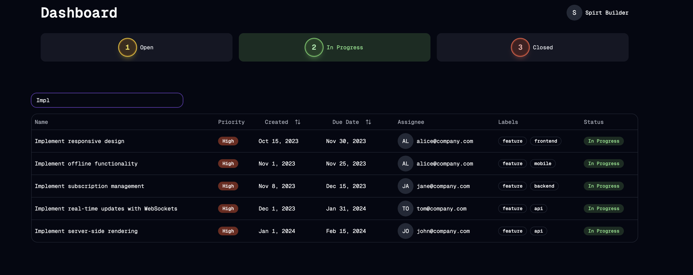

# SuperTracker

## Easiest way to organize your tasks

A modern, keyboard-first task management application built with the T3 Stack.



## Tech Stack

- ⚡ [Next.js 15](https://nextjs.org) with App Router for the framework
- 🔐 [NextAuth.js](https://authjs.dev) for authentication
- 🎨 [Tailwind CSS](https://tailwindcss.com) for styling
- 🔤 [Geist Mono](https://vercel.com/font) for typography
- 📊 [Drizzle](https://orm.drizzle.team) for database ORM
- 🎯 [Shadcn UI](https://ui.shadcn.com/) for UI components
- 📋 [TanStack Table](https://tanstack.com/table) for table management
- 🎨 [Framer Motion](https://www.framer.com/motion/) for animations
- 📦 [Lucide](https://lucide.dev/) for icons
- 🚀 [Vercel](https://vercel.com) for hosting

## Core Features

### Task Management

- [x] Three-tab system for task organization:
  - Open
  - In Progress
  - Closed
- [x] Task listing in data tables with columns for:
  - Name
  - Priority
  - Created date
  - Due date
  - Assignee
  - Labels
  - Status

### Keyboard Navigation

- [x] Arrow key (↑↓) navigation through task rows
- [x] Enter key to open task details
- [x] Left/Right (←→) arrow navigation in focus mode
- [x] Numeric shortcuts (1,2,3) for status changes

### Task Details Modal

- [x] Detailed task information view
- [x] Comment system
  - [x] Add new comments
  - [x] View comment history
- [x] Status management
  - [x] Status change dropdown
  - [x] Confirmation modal for status changes
- [x] Real-time updates without breaking modal navigation

### Enhanced Features

- [x] Filtering system
  - [x] Filter by name
- [x] Multiple sorting options
  - [x] Creation date
  - [x] Due date

### Future Features

- [ ] Loading with infinite pagination
- [ ] Advanced filtering system
  - [ ] Multiple filter combinations
  - [ ] Save custom filters
- [ ] Global search functionality
- [ ] Showing and maintaining counts in tabs
- [ ] Having the option to take action on any row from the table itself.

## Getting Started

1. Clone the repository
2. Install dependencies:
   ```bash
   pnpm install
   ```
3. Copy `.env.example` to `.env` and fill in your environment variables
4. Run the development server:
   ```bash
   pnpm dev
   ```
